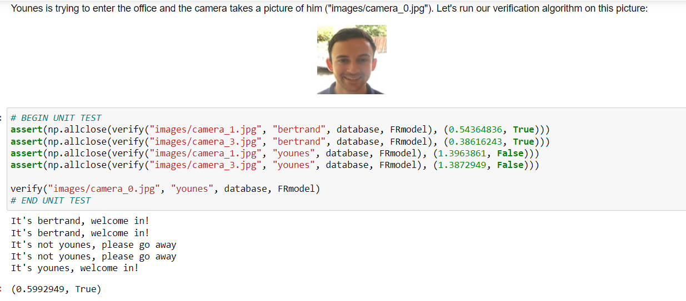

# Deep Learning Mini projects

## Project 1:

Implemented U-Net model for semantic image segmentation on the CARLA self-driving car dataset.Applied sparse categorical cross-entropy for pixelwise prediction

## Project 2:

Implemented One-shot learning based on ideas from FaceNet model.Applied the triplet loss function to learn a network's parameters in the context of face recognition. Mapped face images into 128-dimensional encodings using a pretrained model. Performed face verification and face recognition with these encodings

## Project 3:

Implemented the YOLO algorithm using pre-trained weights to perform object detection on images captured by car dashboard cameras

**Folder structure:**

- U-Net : Contains the Jupyter Notebook with the U-Net model for precise semantic image segmentation on the CARLA self-driving car dataset
- Face Recognition : Contains the Jupyter Notebook with the model for face verification and face recognition
- YOLO Object detection: Contains the Jupyter Notebook with the model to perform object detection on images captured by car dashboard by using YOLO

**Required libraries**: NumPy, SciPy, Matplotlib, Pillow,Tensorflow, Keras

## How to run the model ?

1. Install the required packages using pip, or anaconda, or any other method
2. Run the Jupyter Notebook present in each of the folder to run the code for the resepective projects

## Snapshot

U-Net:

  

Face recognition:

  

YOLO object detection:

  
